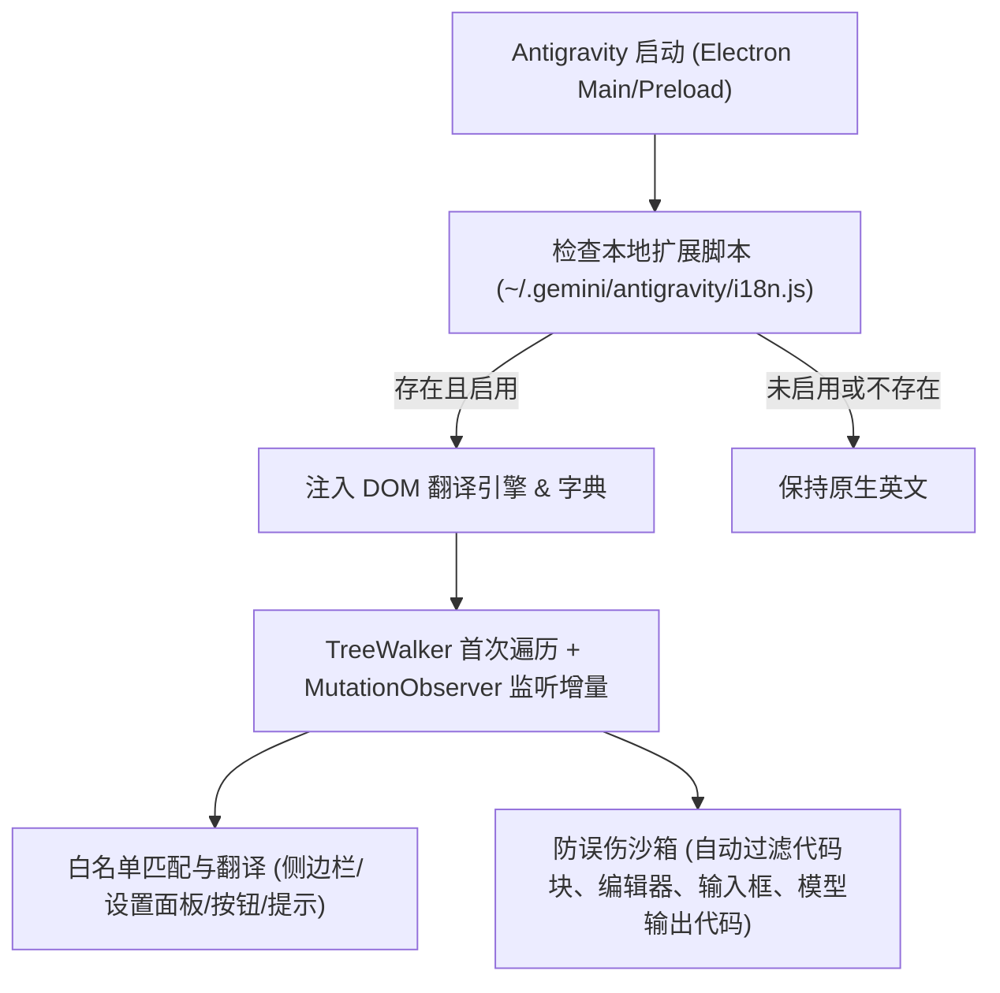

# Antigravity 2.0 客户端轻量级中文化注入补丁方案

本文档规划了针对 **Antigravity 2.0 独立桌面端** 的轻量级、无感、可热更新且支持一键卸载的客户端中文化（汉化）方案。

---

## 一、 技术可行性验证结论（已实测验证）

在刚才的定向技术验证中，我们通过 Chrome DevTools 协议在当前正在运行的 Antigravity 客户端中成功注入了轻量级翻译原型。
实测证明：
1. 客户端侧边栏（`New Conversation` $\rightarrow$ **新建会话**，`Scheduled Tasks` $\rightarrow$ **计划任务**，`Projects` $\rightarrow$ **项目管理**）成功完成即时汉化；
2. 页面交互、消息收发、React 状态树与路由切换完全正常，无任何报错或性能损耗。

---

## 二、 架构设计与实施原则

为了保证客户端的稳定与安全，本方案遵循以下原则：

### 1. 核心解耦设计
* **极小侵入钩子**：仅在客户端入口注入 5 行无害引导代码，指向用户目录下的独立脚本：
  `C:\Users\Administrator\.gemini\antigravity\i18n.js`。
* **字典独立与热编辑**：所有的中英词条对照表均保存在独立的 `i18n.js`（或 `dict.json`）中。用户无需重新打补丁，直接修改字典即可增加或微调翻译。
* **一键启停 / 卸载**：
  * 在字典顶部设置 `window.__ENABLE_CHINESE__ = true / false` 即可随时开关。
  * 提供 `patch_i18n.py --install` 和 `patch_i18n.py --uninstall`（秒级自动备份与完整还原）。

---

## 三、 汉化词典覆盖规划

### 1. 侧边栏与主导航
* `New Conversation` $\rightarrow$ 新建会话
* `Projects` $\rightarrow$ 项目管理
* `Scheduled Tasks` $\rightarrow$ 计划任务
* `Skills & Customizations` $\rightarrow$ 技能与定制
* `Settings` $\rightarrow$ 设置
* `Conversation History` $\rightarrow$ 会话历史
* `Standalone` $\rightarrow$ 独立会话

### 2. 对话操作栏与状态区
* `Agent` $\rightarrow$ 智能体
* `Planning` $\rightarrow$ 规划模式
* `Fast` $\rightarrow$ 快速模式
* `Files Changed` $\rightarrow$ 文件变更
* `Background Tasks` $\rightarrow$ 后台任务
* `Subagents` $\rightarrow$ 子智能体
* `Artifacts` $\rightarrow$ 产物文档
* `Terminal` $\rightarrow$ 终端
* `Ask anything, @ to mention, / for workflows` $\rightarrow$ 输入任何问题，@ 引用上下文，/ 触发工作流

### 3. 全局设置面板（重点汉化：降低理解门槛）
* `Global Settings` $\rightarrow$ 全局设置
* `Project-Level Settings` $\rightarrow$ 项目级设置
* `Model Selection` $\rightarrow$ 模型选择
* `Tool Execution Policy` $\rightarrow$ 工具执行策略
  * `always-proceed` $\rightarrow$ 始终执行（不询问）
  * `request-review` $\rightarrow$ 请求人工审查
  * `proceed-in-sandbox` $\rightarrow$ 在沙箱中安全执行
* `Terminal Sandbox` $\rightarrow$ 终端沙箱
* `Non-Workspace File Access` $\rightarrow$ 工作区外文件访问策略
* `Internet Access Policy` $\rightarrow$ 网络访问策略
* `Permission Grants` $\rightarrow$ 权限授权规则
* `Command Allowlist / Denylist` $\rightarrow$ 命令白名单 / 黑名单
* `Browser Allowlist` $\rightarrow$ 浏览器允许域名列表
* `Artifact Review Mode` $\rightarrow$ 产物审查模式
* `Notifications` $\rightarrow$ 系统通知
* `Appearance` $\rightarrow$ 外观与主题
* `App Settings` $\rightarrow$ 客户端基础设置

### 4. 保留英文 / 建议中英对照的技术词汇
* 斜杠命令保留原名（如 `/goal`, `/schedule`, `/boost`, `/learn`）
* 专有名词保留（如 `MCP`, `Token`, `Diff`, `AST`）

---

## 四、 防误伤机制（安全隔离）

为杜绝翻译引擎破坏代码、提示词或用户输入：
1. **严格排除选择器**：
   * 标签白名单过滤：跳过 `<pre>`, `<code>`, `<textarea>`, `<input>`（只翻译 placeholder）。
   * 类名与属性过滤：跳过 `.monaco-editor`、`[data-lexical-editor]`、`.prism-code`、`.syntax-highlight`。
2. **精确节点判定**：
   * 仅在纯文本节点（`nodeType === 3`）且完全匹配词典时替换，不进行模糊整句破坏。
   * 聊天气泡内的大段正文不进行粗暴子串替换，仅翻译系统 UI 标签与操作按钮（如 `Copy`, `Retry`, `Proceed`, `Allow`, `Deny`）。

---

## 五、 实施步骤

1. **步骤 1：构建独立汉化脚本与词典**
   * 在 `C:\Users\Administrator\.gemini\antigravity\i18n.js` 创建完整的 DOM 翻译引擎与初版全功能中英词典。
2. **步骤 2：创建自动化安装/卸载补丁工具**
   * 编写 `C:\Users\Administrator\.gemini\antigravity\patch_i18n.py`。
   * 自动备份原客户端文件为 `.original.bak`。
   * 支持一键打入钩子与一键完整复原。
3. **步骤 3：验证与微调**
   * 重启客户端检验侧边栏、主对话区、设置面板汉化效果。
   * 确认代码块与输入框未受任何干扰。

---

## 六、 验证计划

### 1. 功能验证
- [ ] 侧边栏按钮、历史列表与通用按钮显示规范中文
- [ ] 打开 Settings 弹窗，各项策略与安全选项显示清晰中文
- [ ] 检查代码渲染区域（Pre/Code/Monaco）保持原样代码，无文本被乱换
- [ ] 检查文本输入框（Textarea）输入不受影响
- [ ] 测试一键卸载脚本，确认客户端可 100% 恢复初始状态
